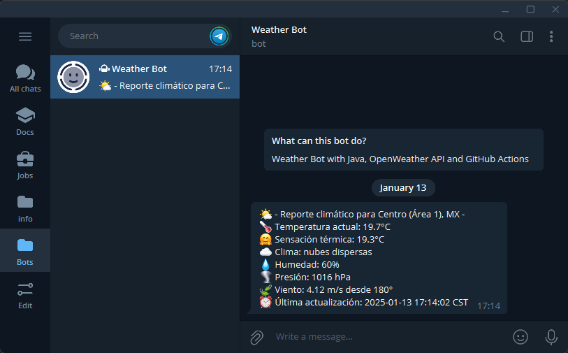

  <h1 align="center"><a href="https://github.com/ASJordi/telegram-weather-bot">Telegram Weather Bot</a></h1>

## About :computer:

Java application that allows you to periodically check the weather for a specific city automatically via a Telegram bot. The information is retrieved from the [OpenWeatherMap API](https://openweathermap.org/api), processed using the [Jackson Databind](https://github.com/FasterXML/jackson-databind) library, and sent via a Telegram bot using the [TelegramBots](https://rubenlagus.github.io/TelegramBotsDocumentation/telegram-bots.html) library. The application runs automatically every 4 hours using a GitHub Actions workflow.

> This project is also available using Azure Functions, check it out [here](https://github.com/ASJordi/azure-telegram-weather-bot)

    

## Features :sparkles:
- Make and process API requests.
- Convert API responses into Java objects.
- Process weather data retrieved from the API.
- Send messages via a Telegram bot.
- Automate message delivery using GitHub Actions.

## Classes :books:
- `bot package`: Contains classes representing the Telegram bot.
- `logger package`: Contains classes for configuring the application logger.
- `request package`: Contains the class responsible for making API requests.
- `weather package`: Contains classes to process the data retrieved from the API.
- `GlobalProperties`: Class responsible for loading environment variables.
- `Main`: Main class that executes the application.

## Technologies :gear:

- Java 21
- GitHub Actions
- Maven
- Lombok
- TelegramBots
- Jackson Databind
- Java Logging

## Installation :floppy_disk:

Before starting, consider the following:

- You need an account with [OpenWeatherMap](https://openweathermap.org/api) to get an API token.
- Create a Telegram bot and get the token and chat ID using [BotFather](https://telegram.me/BotFather).

Steps to install the application:

1. Clone the repository.
2. Open the project in an IDE.
3. Install the required dependencies.
4. Set up the following environment variables:
    - `OPENWEATHER_API_URL`: OpenWeatherMap API URL, default is `https://api.openweathermap.org/data/2.5/weather`.
    - `OPENWEATHER_TOKEN`: API access token from OpenWeatherMap.
    - `OPENWEATHER_ZIP_CODE`: City zip code, e.g., `06000,MX`.
    - `OPENWEATHER_LANG`: API response language, e.g., `en`.
    - `OPENWEATHER_UNITS`: Temperature unit, e.g., `metric`.
    - `TELEGRAM_BOT_TOKEN`: Telegram bot token.
    - `TELEGRAM_CHAT_ID`: Telegram chat ID.
5. Run the program.

> To run the application automatically using GitHub Actions, configure the environment variables in the repository settings.

## License :page_facing_up:

Distributed under the MIT License. See `LICENSE` for more information.

## Contact :email:

Jordi Ayala - [@ASJordi](https://x.com/ASJordi)

Project link: [https://github.com/ASJordi/telegram-weather-bot](https://github.com/ASJordi/telegram-weather-bot)
